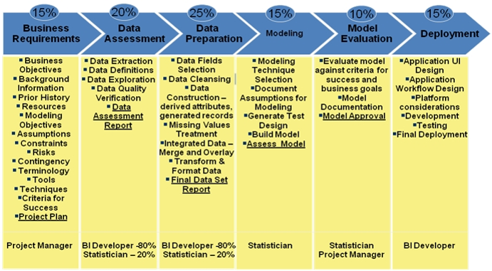

```{r setup, include=FALSE}
knitr::opts_chunk$set(echo = TRUE)
```


```{r include=FALSE}
library(DiagrammeR)
```

La metodología que se usa diariamente es la CRISP, se trabaja principalmente en el lenguaje R y bases de datos Oracle, SQL y git-tfs para windows donde se maneja el control de versión.


 

... 


```{r echo=FALSE}
grViz("digraph worflow{

 graph [layout = dot,label = 'Diagrama Flujo de trabajo']


      # node definitions with substituted label text

      node [fontname = Helvetica, style = filled, fillcolor = Linen]       

      tab1 [label = '@@1', shape = folder, fillcolor =LightSteelBlue ]

      tab2 [label = '@@2']

      tab3 [label = '@@3']

      tab4 [label = '@@4', shape = folder, fillcolor =LightSteelBlue]

      tab5 [label = '@@5']

      tab6 [label = '@@6']

      tab7 [label = '@@7']

      tab8 [label = '@@8']

      tab9 [label = '@@9']

      tab10 [label = '@@10', shape = folder, fillcolor =LightSteelBlue]

      tab11 [label = '@@11']

      tab12 [label = '@@12']

      tab13 [label = '@@13']

      tab14 [label = '@@14']

      tab15 [label = '@@15']

      tab16 [label = '@@16' ]

 
    # edge definitions with the node IDs

      tab1 -> tab2 -> tab3 -> tab7
      tab4 -> tab8
      tab4 -> tab5 -> tab6
      tab8 -> tab9 
      tab8 -> tab11
      tab5 -> tab11
      tab11 -> tab9
      tab11 -> tab5
      tab8 -> tab5
      tab5 -> tab8
      tab10 -> tab12
      tab10 -> tab13
      tab10 -> tab14
      tab14 -> tab15
      tab14 -> tab16

      }

 

      [1]: 'Requerimiento'
      [2]: 'Entendimiento del proyecto'
      [3]: 'Factibilidad'
      [4]: 'Herramientas'
      [5]: 'BD - ORACLE'
      [6]: 'Web service'
      [7]: 'líder del negocio'
      [8]: 'R'
      [9]: 'git TFS'
      [10]: 'Despliegue'
      [11]: 'Modelos'
      [12]: 'Archivos planos'
      [13]: 'Rmardown'
      [14]: 'Web services'
      [15]: 'API rest'
      [16]: 'Html'")
```

De inicio, es claro que nuestra forma de trabajo posee 6 etapas, pero no representa un proceso lineal, es decir, una vez que finaliza una etapa puede haber dependencia con la siguiente fase o se puede adelantar etapas en cierto punto del proyecto y existen diversos actores, un grupo de trabajo multidisciplinario.

# Preguntas

*Transparencia*: En mi equipo de trabajo lo utilizamos para que todos los colaboradores que programamos podamos revisar los projectos y los cambios que hemos realizado, además, es una herramienta que sirve para que nuestro jefe lo revise.

*Capacidad de mantenerlo*: Sí, porque todo el código se utiliza en repositorios y se puede devolver a traves del tfs.

*Modularidad*: Todos los componentes del trabajo están separado a través de la metodología CRISP. 

*Portabilidad*: Tener en un servicio web en tfs nos permite levantar los proyectos de forma fácil.

*Reproducibilidad y eficiencia*: Al mantener de manera virtual puedo reproducir todo el processo muy fácil desde bases de datos hasta replicar el código, el único problema es el control de versiones de los paquetes.
