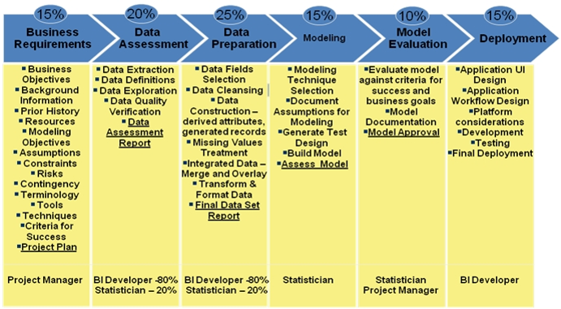

```{r setup, include=FALSE}
knitr::opts_chunk$set(echo = TRUE)
```

La metodología que se usa en mi trabajo es la CRISP, además, trabajamos principalmente en el lenguaje R, oracle y tfs para control de versión.


 

... 
De inicio, es claro que nuestra forma de trabajo posee 6 etapas, pero no representa un proceso lineal, es decir, una vez que finaliza una etapa puede haber dependencia con la siguiente fase o se puede adelantar etapas en cierto punto del proyecto y existen diversos actores, un grupo de trabajo multidisciplinario.